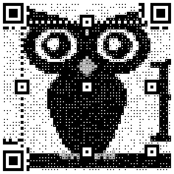
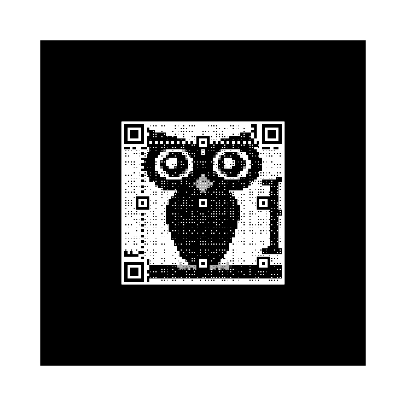

*[Back to the main page](../README.md)*

# AR Markers with Embedded QR Logos

It is nice when the AR marker includes a QR code.
That way, by pointing the mobile, with a QR scanner app running,
to the marker, a url is found.
If you make the url point to your augmented reality scene,
voila, you click in the url and you find your reality augmented.

In this case, we will use QR codes with embedded logos,
which makes it much more funny: you see an AR marker
which is a logo "converted" into a QR code.
You point to it, and you get an AR scene with something related to the logo.

I will use (with permission) the logo that my friends at Bitergia
provided me (please note the logo is a trade mark by Bitergia,
but you can use specifically for this purpose).

## For the QR (QArt) Logo

First, I need to produce the QR logo.
For that, I will use the nice [PyQart Python library](https://github.com/7sDream/pyqart),
and a [very simple script](https://github.com/jgbarah/aframe-playground/blob/master/ar-02/py-quart.py) I built.

In a Python environment, from the directory where you installed the script, run:

```bash
$ pip install pyqart
$ ./py-quart.py bitergia-owl-big.png --dir qrs --url https://jgbarah.github.io/aframe-playground/ar-02/ar.html
```

In this case, `bitergia-owl-big.png` is the image I'm using as the logo,
`qrs` the directory where the script will produce the resulting QR files
(the directory must exist in advance), and the url is the link that will be
embedded in the QR code.

The result is a collection of several QR codes, produced using
different options provided by PyQart.
Among the files produced, I select
[halftone-pixel.png](https://github.com/jgbarah/aframe-playground/blob/master/ar-02/halftone-pixel.png)
as the basis for the AR marker.



## Building the AR marker

As commented in the [blog post about using AR.js with A-Frame](https://aframe.io/blog/arjs/),
I use the [marker trainer provided with AR.js](https://jeromeetienne.github.io/AR.js/three.js/examples/marker-training/examples/generator.html).
I just upload the QR file produced above, and then
download the files produced by the trainer:
[pattern-marker.patt](pattern-marker.patt)
and [marker.png](marker.png).
The first one is the pattern file, used to tell AR.js
how to recognize the marker.
The other one is the marker itself:



For convenience, I've produced some PDF files with the maker,
ready to print: [marker.pdf](marker.pdf) (four pages, with one QR in each of them),
[marker-2up.pdf](marker-2up.pdf) (two pages, with two QR codes each),
and [marker-2up.pdf](marker-4up.pdf) (one page, with four QR codes).

## Building the scene

The scene is easy to produce: a JavaScript script defininf a "brick",
and bulding the Bitergia logo with those bricks, and some positioning.

Enter [the resulting scene](ar.html)
(load the link in your mobile, and point it to a printout of the marker, above),
or check its complete [source code](https://github.com/jgbarah/aframe-playground/blob/master/ar-02/ar.html)
