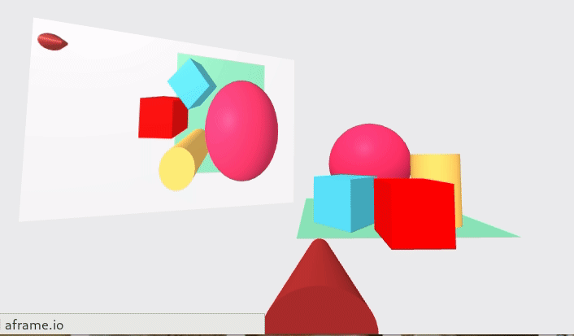

*[Back to the main page](../README.md)*

## Cameras and screens

Let's explore how we can have more cameras in the scene, and how
we can project what those cameras "see" in different surfaces of the scene itself.
In the process, we will learn to write a simple component for
rendering the view of a camera to a canvas, suitable for be used as the material
for AFrame objects.

### A screen with the view of a secondary camera

Let's start with a secondary camera, positioned above the scene,
looking down. I will show the output of that camera in a screen in the scene.
So, we will need an element for the secondary camera, and another
one for the screen (in this case, a plane will be enough).

The code for the main camera is like the one we're used to have
(for example, in the final example in
[Learning to move](../interaction-01/README.md)):

```html
<a-entity position="0 0 5" movement-controls="fly: true; speed: 0.1">
  <a-entity camera position="0 1.6 0" look-controls>
    <a-cone color="brown" radius-bottom=".2" radius-top=".05" height=".5"
            position="0 -.6 -1" rotation="-80 0 0"></a-cone>
    </a-entity>
</a-entity>
```

We have the usual rig, positioned in front of the scene, with
`movement-controls`, so that we can move
in desktop using the arrow keys, and in the Oculus Go using the touchpad.
Attached to that rig we have the camera, positioned at a height of 1.6
(simulating eyes height of a person), with `look-controls`,
so that the camera moves when the gaze changes (for example, when
you move the headset).
I have attached a cone to the camera, to act as a kind of "nose",
so that we can have a reference of where in the scene
is the main camera, and where is it pointing to.
This will come handy to find yoourself in the screen.
Since the cone should have the rotation set by look-controls,
for example when we move the head with a hadset,
it needs to be an inner element to the entity with the camera.

The HTML code for the secondary camera (the one I will project on the screen)
is as follows:

```html
<a-entity camera="active: false" camrender="cid: cam2"
          position="1 5 0" rotation="-90 -90 0">
</a-entity>
```

The camera is positioned above the scene, looking down, and rotated 90 degreees.
Its active property is set to false because this is not the main camera of the scene.
The trick of this camera is in the `camrender` component.
[Later on](#the-camrender-component) I will discuss how the component is implememnted,
but for now it is enough to say that it will use a canvas element to produce a rendering
of the view of the camera. This canvas element is suitable for being used as the material for an AFrame object.
The `cid` property of `camrender` is the HTML id of that canvas,
which will usually live within the `a-assets` element of the scene:

```html
      <a-assets>
        <canvas id="cam2"></canvas>
      </a-assets>
```

To use the `camrender` component we need to include in the HTML `head` the JavaScript script
that implements it. Assuming it is in file `camrender.js`, available from the same directory:

```html
<script src="camrender.js"></script>
```

The rest is just using the canvas element
as the material for the screen. I will use a plane, of the same form factor
used by the renderer by default (400x300):

```html
<a-plane position="-4 2 0" rotation="0 20 0" width="4" height="3"
         material="src:#cam2; opacity: .95"></a-plane>
```

I placed the plane on the left of the scene, facing the main camera.
The main component is of course `material`,
with its `src` property pointing to the canvas created for the secondary camera.
`opacity` is not really needed in this case, but fancy.

You can visit [the resulting scene in your browser](cameras-1.html),
or check its complete [source code](https://github.com/jgbarah/aframe-playground/blob/master/camrenderer-01/cameras-1.html)

The final result is like this:



### The camrender component

As shown in the example above, to make the secondary camera render its output in a
`canvas` HTML element we used the `camrender` component.
Check [its complete code](https://github.com/jgbarah/aframe-playground/blob/master/camrenderer-01/camrender.js),
it is not that difficult to understand if you have read about
[components in the AFrame documentation](https://aframe.io/docs/1.4.0/core/component.html).
The code is a copy, with slight modifications, of the one shown in
[How to use cameras output as a texture in AFrame](https://wirewhiz.com/how-to-use-a-cameras-output-as-a-texture-in-aframe/)
Let's visit some parts of this code.

```javscript
AFRAME.registerComponent('camrender',{
    'schema': {
       fps: {
            type: 'number',
            default: 90.0
       },
       cid: {
            type: 'string',
            default: 'camRenderer'
       },
       height: {
            type: 'number',
            default: 300
       },
       width: {
            type: 'number',
            default: 400
       }
    },
    ...
});    
```

We start with a call to `AFRAME.registerComponent`,
with the name of the component as first parameter (`camrender`),
and a JavaScript object with the implementation of the component
as second parameter.

The first property of the implementation of the component is `schema`,
which defines tha properties of the AFrame component
(in this case `fps`, `cid`, `height`, and `width`), with their
types and dafault values.
These properties
will be available in other functions of the implementation of the component
as properties of `this.data`.
They can be set in HTML using CSS notation, such as for example
`camrender="cid: cam2; width: 200"`.

The properties that allowed for the 'camrender' component are:

* `fps`: the desired frames per second for rendering the view of the camera
* `cid`: the HTML id of the canvas where the rendered image will be produced
* `height`: the height of the canvas
* `width`: the width of the canvas

Then, we have the `init` function, which will be called when
the component is initializated:

```javascript
'init': function() {
    // Counter for ticks since last render
    this.counter = 0;
    // Find canvas element to be used for rendering
    var canvasEl = document.getElementById(this.data.cid);
    // Create renderer
    this.renderer = new THREE.WebGLRenderer( { antialias: true, canvas: canvasEl } );
    this.renderer.setPixelRatio( window.devicePixelRatio );
    this.renderer.setSize( this.data.width, this.data.height );
    // Set properties for renderer DOM element
    this.renderer.domElement.crossorigin = "anonymous"
    this.renderer.domElement.height = this.data.height;
    this.renderer.domElement.width = this.data.width;
},
```

This code will initialize a counter that will be used for tracking ticks
(see below), and then will find the canvas for rendering the output of the camera
(given its HTML id).
A renderer is created in the canvas, by instantiating `THREE.WebGLRenderer`,
a WebGL renderer, with the canvas element that we just found.
We set the pixel ratio (obtained from `window`),
and the size of the renderer (using the properties explained above).
Then, we add some DOM properties to the canvas element.

The `tick` function is called for every AFrame `tick`:

```javascript
'tick': function(time, timeDelta) {
    var loopFPS = 1000.0 / timeDelta;
    var hmdIsXFasterThanDesiredFPS = loopFPS / this.data.fps;
    var renderEveryNthFrame = Math.round(hmdIsXFasterThanDesiredFPS);
    if(this.counter % renderEveryNthFrame === 0){
        this.renderer.render( this.el.sceneEl.object3D , this.el.object3DMap.camera );
        }
    this.counter += 1;
},
```

This function decides if it is time to produce a new rendering or not,
depending on the tick number (maintained by `this.counter`)
and the selected frame rate.
New renderings are produced
by calling the `render` function of the rendering object we built
in the canvas during the initialization (see above) of this component.
The parameters to `render` are the objects corresponding to the
AFrame scene, and the camera.

In the following examples, we will use this `camrender.js` script to 
provide the `camrender` component.

### Screens as texture

In the previous example, I used a plane as a screen.
But in fact, we can use any surface to project the output of the camera,
by setting its material to the `canvas` created by `camrender`.
In this example, I use a box, instead of a plane, for projecting the output of the
secondary camera. The code is as follows:

```html
<!-- Box for showing the secondary camera -->
<a-box position="-3 2 -1" width="3" height="2" depth="3"
     material="src:#cam2"></a-box>
```

We also add an animation to the sphere, so that changes in the scene are more evident.
The rest is exactly as in the previous example.

Enter [this scene in your browser](cameras-2.html),
or check its complete [source code](https://github.com/jgbarah/aframe-playground/blob/master/camrenderer-01/cameras-2.html)

The final result is like this:


### Main camera can be in a screen too

Not only the secondary camera can be used as material for a surface,
the main camera too. In this example, we project the secondary
camera on a cube, as before, and the main camera on a plane
(on the right of the scene).

For that, we only need to add the `camrender` component to the
main camera:

```html
<a-entity position="0 0 5" movement-controls="fly: true; speed: 0.1">
  <a-entity camera camrender="cid: cam1" position="0 1.6 0" look-controls></a-entity>
  ...
</a-entity>
```

And a new plane for the output of this main screen
(note the reference to `#cam1`, which is the identifier of the
renderer canvas for the main camera):

```html
<a-plane position="3 1 1" rotation="0 -15 0" width="4" height="3"
         material="src:#cam1; opacity: .95"></a-plane>
```

We will also need to create a new canvas, with this `cam1` id, in the `a-assets` element:

```html
      <a-assets>
        <canvas id="cam1"></canvas>
        <canvas id="cam2"></canvas>
      </a-assets>
```

Enter [this scene in your browser](cameras-3.html),
or check its complete [source code](https://github.com/jgbarah/aframe-playground/blob/master/camrenderer-01/cameras-3.html)

The final result is like this:


