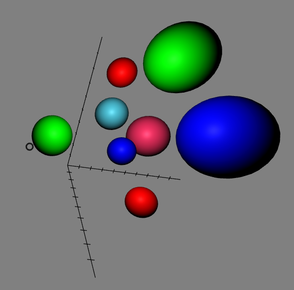

*[Back to the main page](../README.md)*

## Visualizing data

Now, I'm going to work in `data-01`,
visualizing some data points with a scatterplot
(each dot will be an sphere).



### What's in the code

The relevant code is now in [data.js](`src/data.js`)
The code starts by defining a variable, `items`, which is an array of
the data points to visualize. For each data point we have three coordinates,
a size, and a color:

```javascript
var items = [
    {x: 2, y: 8, z: 0, size: 1, color: "#ff0000"},
    ...
    {x: 2, y: 10, z: 6, size: 1.5, color: "#00ff00"}
];
```

Then, there is a function, `plotAxis` to plot the X, Y and Z axis, including
ticks every unit. For it, we use `line` A-Frame components.
For example, for creating the X axis, we just add a line to the
`axis` element, and then in a loop, we again use lines to
display ten ticks:

```javascript
axis.setAttribute('line__x', {'start': {x: 0, y: 0, z: 0},
                           'end': {x: 10, y: 0, z: 0},
                           'color': color});
for (var tick = 1; tick < 10; tick++) {
  axis.setAttribute('line__x' + tick, {'start': {x: tick, y: -0.2, z: 0},
                             'end': {x: tick, y: 0.2, z: 0},
                             'color': color});
};
```

After that, there is another function, `plotDot` to plot a data point.
It just creates a sphere, adds the attributes to position it according
to the intended coordinates, and adds a even listener to make it larger
when the pointer is over it:

```javascript
function plotDot (scene, position, size, color) {
  var sphere = document.createElement('a-sphere');
  sphere.setAttribute('radius', size);
  sphere.setAttribute('position', position);
  sphere.setAttribute('color', color);
  sphere.addEventListener('mouseenter', function () {
    sphere.setAttribute('scale', {x: 1.3, y: 1.3, z: 1.3});
  });
  ...
  scene.appendChild(sphere);
};
```

Finally, we have some code that is triggered when the DOM is composed,
and adds the axis and the data points, using the above functions.

So, not a big deal, little new from A-Frame here: this exercise
is just using what we already know to produce a simple data points
visualization.

### Generating dist files and running everything

As we saw in the previous section, the complete process to build the project is:

```
$ cd data-01
$ npm install
$ npm run start
```

This will build everything,
you will only need a browser to see the resulting scene.

### Results

Check the resulting [virtual reality scene](web/index.html).
