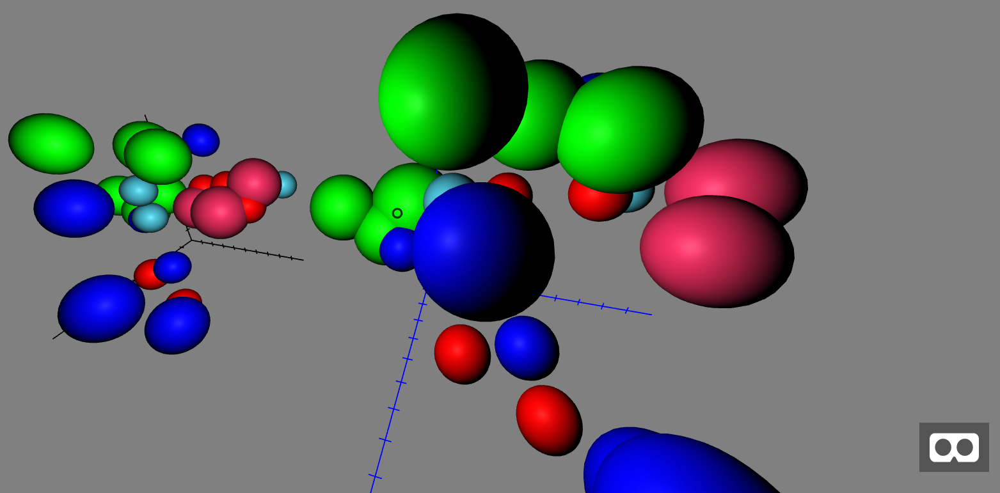

*[Back to the main page](../README.md)*

## Visualizing data (JSON documents)

Now, let's work in `data-04`,
still visualizing some data points with a scatterplot
(each dot will be an sphere), with an axis.
We will produce a visualization similar to ones in
[data-01](../data-01) and [data-02](../data-02) and
[data-04](../data-04).
But now, the component producing the visualization will
accept the data as a JSON document.

The new stuff added in this exercise is heavily inspired
in the
[A-Frame GeoJSON component](https://github.com/mattrei/aframe-geojson-component),
and in particular in
[geojson.js](https://github.com/mattrei/aframe-geojson-component/blob/master/src/geojson.js)

### Managing JSON documents

Now, the data will be, with the same format, in the
[data.json](src/data.json) document, in JSON format.
Therefore, we need two main changes:

* Tell Webpack that we have a new JSON file.
* Make the `plot` component have a property for specifying the url
to the JSON document to use, and extract the data from it.

### Changes to Webpack

The changes to Webpack are easy, and similar to what we already did in
the [figures-03](../figures-03) exercise.

First, in `webpack.config.js` we add, to the `module.rules` property
the code needed to process JSON files:

```javascript
// JSON files
{
  type: 'javascript/auto',
  test: /\.json$/,
  include: [path.resolve(__dirname, 'src')],
  use: [
    {
      loader: 'file-loader',
      options: {name: '[name].[ext]'}
    }
  ]
}
```

That is, let the file-loader produce a copy of the JSON file.

And second, we need to specify that we depend on the JSON file, so
that it gets pulled by Webpack in the `dist` directory. For this,
we add this dependency to [data.js](src/data.js):

```javascript
import data from './data.json';
```

### Changes to the components

First of all, let's change the `datapoints` property of the `plot` component
to be an asset. This will allow it to be a JSON document:

```javascript
AFRAME.registerComponent('plot', {
    schema: {
      ...
      datapoints: {type: 'asset'}
    },    
```

Once we have the asset in the schema, we need to include the
code for loading the corresponding document, and extracting the
data from it. We will do this with the help of the `loader` function
from THREE:

```javascript
init: function () {
  var self = this;

  this.loader = new THREE.FileLoader();
},
update: function (oldData) {
  const data = this.data;
  ...
  if (data.datapoints && data.datapoints !== oldData.datapoints) {
    this.loader.load(data.datapoints, this.onDataLoaded.bind(this));
  }
},
```

That is: we define `this.loader` in the function (`init`) which is
called when the component is created, and then register the
`onDataLoaded` function to be triggered once `this.loader` (the
THREE document loader function) has done its job, and we have the document.
`onDataLoaded` will do most of the real work: extract the data from
the received JSON document, and create all the elements, quite similar
to how we created them in the previous exercises:

```javascript
onDataLoaded: function (file) {
  var self = this;
  const data = this.data;
  const pos = data.position;

  // ... create axis

  var datapoints = JSON.parse(file);
  for (let point of datapoints) {

    // ... create spheres for each data point

  };
}
```

### How the component is now created

If we're creating the component in HTML, we will do it as follows
(see [data.html](src/data.html):

```html
<a-entity plot="datapoints: data.json; position: -20 -4 -4; color: black">
</a-entity>
```

If we're creating it form JavaScript code, we will do it as follows
(see at the end of [data.js](src/data.js):

```javascript
var entity = document.createElement('a-entity');
entity.setAttribute('plot', {
  'color': 'blue',
  'size': 1,
  'position': {x: 0, y: 0, z: 0},
  'datapoints': 'data.json'
});
scene.appendChild(entity);
```

Since in our example use both, we're creating in fact two plots,
one in (0,0,0) and another one to its left, and slightly below and behind.
We have also more data points than in the previous exercises.
The result is this:



### Other minor Changes

Up to now, the plot was designed to be placed in (0,0,0), even when
it had some parameters that suggested otherwise. In this example,
the plot can be set in any point, and axis and data points will be
set accordingly. For that, we had to add here and there the coordinates
of the origin, and be a bit careful when creating all objects,
ensuring that we did it in their corresponding coordinates.

### Generating dist files and running everything

As we saw in the previous section, the complete process to build the project is:

```
$ cd data-04
$ npm install
$ npm run start
```

This will build everything,
you will only need a browser to see the resulting scene.

### Results

Check the resulting [virtual reality scene](web/index.html).
