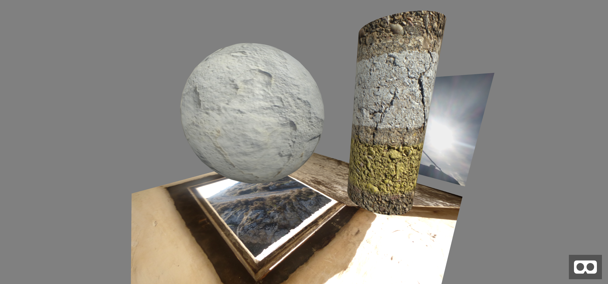

*[Back to the main page](../README.md)*

## First steps in creating an A-frame scene

I will start by using the first example in the
[A-frame Introduction](https://aframe.io/docs/0.8.0/introduction/),
the [Hello, WebVR example](https://aframe.io/docs/0.8.0/introduction/html-and-primitives.html#example).
I've done some minor modifications both for convenience
(I want to export all the assets,
so that the example works even if I'm not connected),
and joy (some images used, for example).  
All the files referenced here are in the `figures-01` directory
in this repository.

### First version of the first steps

My first version of that example is `first.html`,
where I create a scene with a box, a sphere and a cylinder,
on top of a plane, with a grey sky as background.
In use some pictures for the box, sphere, cylinder,
and plane,
which gives the scene a bit more of interest.

For running this first version,
you'll need to have in a directory the following files:

```
figures-01
|- aframe.min.js
|- first.html
|- bands.jpg
|- molinos-bw.jpg
|- window.jpg
|- soil.jpg
```

The result can be seen just by firing the browser on the HTML file:

```bash
$ firefox figures-01/first.html
```

However, the A-frame documentation recommends using a web server instead.
You can easily serve the directory with the scene using
the one line python web server:

```
$ python -m SimpleHTTPServer
```

Or, if you are using Python3:

```
$ python3 -m http.server
```


Or you can
[check the actual scene in your browser](first.html),
if it is supported by A-frame.
You can use arrow keys or WASD keys and the mouse
(click and drag),
to move the camera when not in VR mode.
You can also check it with VR,
for example with a mobile phone in a
[Google cardboard device](https://vr.google.com/cardboard/)
or similar.

Just in case you cannot see it with your browser,
as loaded, the scene is:


After moving around, you may see something like:



Notice that the file `aframe.min.js` is included in the repository
for your convenience.
It is just a copy of the minified A-frame library,
in my case
[aframe.min.js version 0.8.0](https://aframe.io/releases/0.8.0/aframe.min.js).

You can check other ways of installing A-frame in the
[A-frame installation instructions](https://aframe.io/docs/0.8.0/introduction/installation.html).
Later on I will show how to use npm and webpack for
installing A-frame in a more convenient way.
For now, having the file in the repository will be convenient.

The details of what is in the `first.html` file,
which includes all the magic needed to create the scene,
are described in the
[Hello, WebVR example](https://aframe.io/docs/0.8.0/introduction/html-and-primitives.html#example).

*An interesting trick:*
you can enter the A-frame debugger by using the
`<CTRL> <ALT> i` combination when watching the scene in the browser.

*Another one:*

you can get screenshots from the scene,
just press `<ctrl> <alt> s`.
For a 360 image,
press `<ctrl> <alt> <shift> s`.
More details at the
[screenshot Component documentation](https://aframe.io/docs/0.8.0/components/screenshot.html).


### Second version, adding assets

This version, `second.html` is quite similar to the first one,
but includes some new gadgets.
It follows some of the aspects introduced in the guide
[Building a Basic Scene](https://aframe.io/docs/0.8.0/guides/building-a-basic-scene.html).

The sphere now has a 360 image projected on it.
The box is animated, by adding a child element specifying the animation.
And there are a couple lights.
A more subtle, but important change, is that now it uses assets.
the `assets` element allow for the download of the different assets
(in this case, images) without interfering with the main scene,
which uses them.

[Check the actual scene in your browser](second.html).

### Third version, adding text

This version, `third.html` adds some text,
exploring the concepts shown in the
[documentation for the text component](https://aframe.io/docs/0.8.0/components/text.html).

For keeping the application self-contained,
I donwloaded the font files,
`Roboto-msdf.json` and `Roboto-msdf.jpng`
from https://cdn.aframe.io/fonts/
to the same directory where the application is.

I also added a camera, to decide from where I want to look at the scene.
For positioning the camera, I need a wrapper `a-entity` object,
to avoid camera controls overriding position and rotation:

```html
<a-entity position="-3 2 1" rotation="0 -25 0">
  <a-camera></a-camera>
</a-entity>
```

This will locate the camera 3 units to the left, 2 up, and 1 closer
to the origin, pointing slightly (25 degrees) to the right.

[Check the actual scene in your browser](third.html).

### Fourth version, adding behavior

This version, `fourth.html` adds some JavaScript to have the sphere
behave in a certain way when you look at it.
To do that, I first added a cursor element to the camera,
so that the cursor points to where the camera points.

Then, it is just a matter of addint the `script` element at
the end of the HTML code,
to set event listeners for `mouseenter` and `mouseleave`
events in the sphere.
As you can see, this is quite similar to capturing any events
in a regular DOM element.
The only trick is that the cursor that I added to the camera
behaves as a mouse,
and then triggers those `mouseenter` and `mouseleave` events.
See more details about this in
[Adding Interaction, in the Building a Basic Scene guide](https://aframe.io/docs/0.8.0/guides/building-a-basic-scene.html#adding-interaction).

In addition, I try writing text in a plane,
which can be a nice way of providing banners.
See more about this in the
[Sizing section of the documentation of the text component](https://aframe.io/docs/0.8.0/components/text.html#sizing).

[Check the actual scene in your browser](fourth.html).

### Fifth version, playing with entities

In this version, `fifth.html`, I wanted to play with entities.
I liked the `a-curvedimage` primitive,
and I checked how I could produce it with an entity.
I discovered that the equivalence between primitives and
entities is not complete,
and that there is nothing like a `curvedimage` primitive geometry.
In fact, `curvedimage` is built based on `cylinder`.
So, I built the equivalent to a curved image in three
different ways:
with a `a-curvedimage` primitive,
with a `cylinder` primitive,
and with an entity, using `cylinder` as the primitive geometry.

You can learn more about entities in
[ECS in A-frame](https://aframe.io/docs/0.8.0/introduction/entity-component-system.html),
which explains its relationship with components and systems,
in the [documentation for Entity](https://aframe.io/docs/0.8.0/core/entity.html),
and in the
[documentation for Component](https://aframe.io/docs/0.8.0/core/component.html).
The [documentation for Material](https://aframe.io/docs/0.8.0/components/material.html)
and
[for Geometry](https://aframe.io/docs/0.8.0/components/geometry.html)
were also useful.

I also included some fog, which is a component of `a-scene`.
The linear model worked well when I selected the appropriate
`far` and `near` properties.
When using fog, I can omit the `a-sky` element,
since the "sky" will be just an accumulation of fog.
More information in the
[fog Component documentation](https://aframe.io/docs/0.8.0/components/fog.html).

Finally, I included a stats user interface,
by declaring the appropriate `stats` component as a property of
`a-scene`.
More information on that in the
[stats Component documentation](https://aframe.io/docs/0.8.0/components/stats.html).

[Check the actual scene in your browser](fifth.html).
