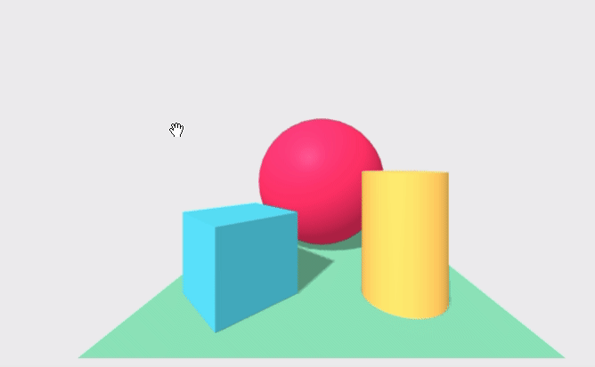

*[Back to the main page](../README.md)*

## Learning to move

I want to move in the scene, and want to select objects, triggering some event when selecting,
that I can use to do something (such as changing some propierty of the object,
or popping up a banner with data about the object, for example).
I want all of this to work in desktop and in Oculus Go,
and to the extent possible, in mobile too.

Since this is not that difficult, but a bit different from other stuff
we have done up to now, I'm going to first show how this is done with a simple example.

### Movement in the scene

Let's start with the basic movement, provided by  AFrame by default.
For this, it is enough to just define which objects we want in the scene,
with no further element:

```html
<a-scene>
  <a-box position="-1 0.5 -3" rotation="0 45 0" color="#4CC3D9" shadow></a-box>
  <a-sphere position="0 1.25 -5" radius="1.25" color="#EF2D5E" shadow></a-sphere>
  <a-cylinder position="1 0.75 -3" radius="0.5" height="1.5" color="#FFC65D" shadow></a-cylinder>
  <a-plane position="0 0 -4" rotation="-90 0 0" width="4" height="4" color="#7BC8A4" shadow></a-plane>
  <a-sky color="#ECECEC"></a-sky>
</a-scene>
```

This will cause the following behavior:

* Desktop: Dragging with the mouse simulates gaze,
and arrow keys (or WASD keys) move the default camera relative to gaze.

* Mobile: Orientation of the screen is used for gaze,
there is no way of moving the camera.

* Oculus Go: Orientation of the headset is used for gaze,
there is no way of moving the camera.

See [this scene in your browser](basic.html),
or check its complete [source code](https://github.com/jgbarah/aframe-playground/blob/master/interaction-01/basic.html)

### Adding a camera

Curiously enough, adding a camera component to the scene makes keys and dragging in desktop,
and camera orientation in mobile, to stop working:

```html
<a-scene>
  ...
  <a-entity camera position="0 1.6 0"></a-entity>
</a-scene>
```

In the Oculus Go, camera orientation (looking around) works,
apparently because the `camera` component includes camera orientation
in the case of the Go (which is reasonable,
since it has a head mounted display).

In mobile, when in browser mode, the scene is also fixed,
like in desktop. But entering VR mode (touching the glasses)
makes camera orientation work when you move the mobile,
like in the Go.

Watch [the scene including a camera](basic-camera.html),
or check its complete [source code](https://github.com/jgbarah/aframe-playground/blob/master/interaction-01/basic-camera.html)


### Recovering camera orientation in desktop

The first step towards recovering movement is to recover camera orientation (gaze)
in desktop. This is easy: just include a
[look-controls](https://aframe.io/docs/1.2.0/components/look-controls.html) component:

```html
<a-scene>
  ...
  <a-entity camera look-controls position="0 1.6 0"></a-entity>
</a-scene>
```

Now, we have a scene that has camera orientation in desktop (clicking and dragging the mouse),
in mobile (moving the mobile in VR mode), and in Go (moving the head).

Watch [the scene](moving-camera.html),
or check its complete [source code](https://github.com/jgbarah/aframe-playground/blob/master/interaction-01/moving-camera.html)

### Recovering movement in desktop

To recover movement of the camera in the scene using the WASD (or arrow)
keys on desktop, we can add a
[wasd-controls](https://aframe.io/docs/1.2.0/components/wasd-controls.html) component.

```html
<a-scene>
  ...
  <a-entity camera look-controls wasd-controls position="0 1.6 0"></a-entity>
</a-scene>
```

When doing this, the scene behaves the same in Go (you get only camera orientation
when moving your head), but in mobile now it also recognizes
touching the screen as the signal for moving forward
(both in desktop and in VR mode).

Watch [the scene](moving-camera-2.html),
or check its complete [source code](https://github.com/jgbarah/aframe-playground/blob/master/interaction-01/moving-camera-2.html)

### Complete movement in all devices

To complete the behaviour in all three devices, we need to have camera
displacement for the camera in Oculus Go. This way,
we can explore the scene:

* In Oculus Go, using gaze (the direction in which I'm looking)
and the touch button in the Go control. Gaze will be used for the relative
direction in which the touch button works (touch front, moves forward,
touch back moves backwards, right and left move perpendicular to gaze).

* For desktop, I will use dragging with the mouse to simulate gaze,
and arrow keys (or WASD keys) for moving relative to gaze.

* For mobile, the orientation of the mobile screen will be used for gaze,
and touching the screen will be used for moving forward.

So, the only thing we miss is displacement in the Go.
I've found no way of getting it with plain AFrame,
so I'm using the
[AFrame Extras library](https://github.com/donmccurdy/aframe-extras),
for getting the `movement-controls` component.

```
<script src="//cdn.jsdelivr.net/gh/donmccurdy/aframe-extras@v6.1.1/dist/aframe-extras.min.js"></script>
```

So, I  build the scene using that component, instead of `a-camera`:

```html
<a-entity movement-controls="fly: true">
  <a-entity camera position="0 1.6 0" look-controls></a-entity>
</a-entity>
```

The `movement-controls` component acts as a rig for the camera.
the `fly: true` parameter is for letting the camera move above and below the
horizontal plane (Y=0).
The `camera` component enclosed in the `movement-controls' component
will move as the `movement-controls` "mandates", based on how the
controls for movement work. In the case of the Go, this is the touchpad
in the Go control, as commented above.
We still need to specify the `look-controls` component,
to control gaze with the mouse in desktop.
We don't need `wasd-controls`, since it is pulled in by
`movement-controls` by default.

Watch [the scene](moving-camera-3.html),
or check its complete [source code](https://github.com/jgbarah/aframe-playground/blob/master/interaction-01/moving-camera-3.html)

The final result is like this:

