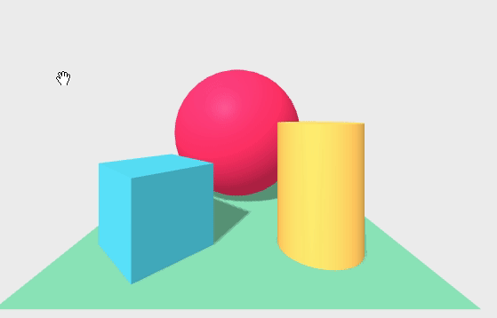

*[Back to the main page](../README.md)*

## Selecting objects

Interacting with the scene means not only moving around,
but also selecting objects.
For that, we will use some mechanism to "select" an object in the scene,
and then raising some event in the corresponding HTML element.
The element will detect that event, and act accordingly.
This is the way selection and actions following selection usually occur in
web front-end programming, so the model will look familiar to people used to
build web front-end applications.

### Raising events with the mouse

When we're in desktop, we can raise events in objects with the mouse.
For that, we need a `cursor` element in the scene.
We can include it as an argument to the scene:

```html
<a-scene cursor="rayOrigin:mouse">
...
</a-scene>
```

Or, maybe more convenientely, include it as an element within the scene
(this is how we will include in the following examples):

```html
<a-scene>
  <a-entity cursor="rayOrigin:mouse"></a-entity>
</a-scene>
```

The cursor is basically defining a ray, that may "touch"
some object, selecting it. Since for now we're using it with a mouse,
we want the ray to come "from the object to where the mouse points".
This is what `rayOrigin:mouse` does.

To find out that we're actually selecting objects, and raising event in them,
we need to define some handler for those events in the objects themselves.
We can for example use some [animation](https://aframe.io/docs/master/components/animation.html).
This will make the box "jump" when we click on it

```html
<a-box position="-1 0.5 -3" rotation="0 45 0" color="#4CC3D9" shadow>
  <a-animation begin="click" attribute="position"
               from="-1 1.5 -3" to="-1 0.5 -3" dur="1000"></a-animation>
</a-box>
```

That is: when the "click" event is detected in this object,
make it go from Y=1.5 to Y=0.5 in one second.
The efect is like if the box "jumps" and then falls down.

We can also make a sphere "grow" when clicked (by acting on its `scale` property),
and a cylinder grow when mouse enters it, and come back to its original size
when muse leaves.

```html
<a-sphere position="0 1.25 -5" radius="1.25" color="#EF2D5E" shadow>
  <a-animation begin="click" attribute="scale" from="2 2 2" to="1 1 1" dur="1000"></a-animation>
</a-sphere>

<a-cylinder position="1 0.75 -3" radius="0.5" height="1.5" color="#FFC65D" shadow>
  <a-animation begin="mouseenter" attribute="scale" to="2 2 2" dur="1000"></a-animation>
  <a-animation begin="mouseleave" attribute="scale" to="1 1 1" dur="1000"></a-animation>
</a-cylinder>
```

Watch [this scene in your browser](selection-mouse.html),
or check its complete [source code](https://github.com/jgbarah/aframe-playground/blob/master/interaction-02/selection-mouse.html)

The final result is like this:



### Supporting Oculus Go control

\[Still working on this \]

For supporting Oculus Go control via the
[AFrame oculus-go-controls component](https://aframe.io/docs/master/components/oculus-go-controls.html),
I need a development version of AFrame,
since the latest release (0.8.2) doesn't seem to support it.
I will a fixed commit, just to avoid regressions,
at least until a new version of AFrame is released.
And I will also use the [AFrame Extras library](https://github.com/donmccurdy/aframe-extras),
for getting the `movement-controls` component.
The reason for this is that, contrary to the `wasd-controls` component,
`oculus-go-controls` does not support movement.

```
<script src="https://rawgit.com/aframevr/aframe/cf15c15/dist/aframe-master.min.js"></script>
<script src="//cdn.rawgit.com/donmccurdy/aframe-extras/v5.0.0/dist/aframe-extras.min.js"></script>
```
