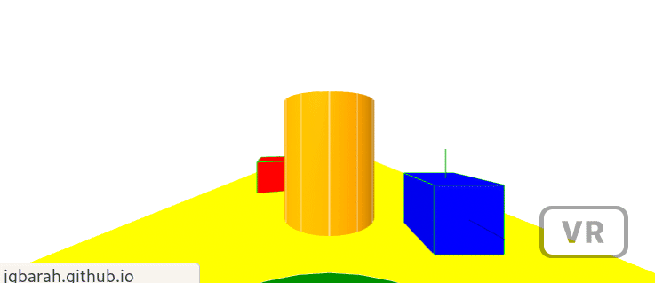

*[Back to the main page](../README.md)*

## A camara respecting (some) physics

When living in a world with physics, we may want the camera to
respect it, but only in part. I still want the camera reacting to
arrow keys (in desktop) or to the touchpad (in Oculus Go) for moving around.
But I want it to collide with objects, so that it doesn't move through them.
I also want the camera to be subject to gravity, if there is gravity in the scene.

*Note: * In many cases, moving the camera with the keys or touchpad is not a good idea,
and it is better to use teleports or meshes for moving around.
But still I find it very convenient for some cases, such as
first person games. Consider moving around in a maze, for example.

### Using kinematic-body

Fortunately, there is a component just for this.
The [kinematic-body](https://github.com/donmccurdy/aframe-extras/blob/master/src/misc/kinematic-body.js)
component of [AFrame Extras](https://github.com/donmccurdy/aframe-extras)
is designed to act as a "rig" for a camera. Unfortunately, it is deprecated,
but [more on that below](#deprecation).

Since 'kinematics-body' builds on a component defined in
[AFrame Physics System](https://github.com/donmccurdy/aframe-physics-system/)
(`velocity`), we need to also includ it.
So, the JavaScript modules included in the `head` of our HTML file will be like this:

```html
<script src="//aframe.io/releases/0.8.2/aframe.min.js"></script>
<script src="//cdn.rawgit.com/donmccurdy/aframe-physics-system/v3.3.0/dist/aframe-physics-system.min.js"></script>
<script src="//cdn.rawgit.com/donmccurdy/aframe-extras/v5.0.0/dist/aframe-extras.min.js"></script>
```

The rest, is adding the rig to the camera:

```html
<a-entity kinematic-body="radius: 0.8" movement-controls="fly: false" position="0 0 5" look-controls>
  <a-entity camera position="0 1.6 0" ></a-entity>
  <a-cylinder height="2" radius="0.8" color="green"></a-box>
</a-entity>
```

The `radius` parameter to `kinematic-body` is the radius of the sphere using to detect collision.
I've set `fly:false` for `movement-controls` to simulate better
a land vehicule (or a person walking), but that's not really needed.
Since `camera` is now in a child entity of the rig, its position is relative to it.
Therefore, seting it to "X=0, Y=1.6, Z=0" will really position it,
when the scene loads, at  "X=0, Y=1.6, Z=5". When the rig moves,
the camera will move with it.

I've added also a cylinder as a child of the rig, just to approximately show
the radius of collision. A sphere would be a better representation, but in this
specific case, the cylinder seems to be easier to see from the camera.

Watch [this scene in your browser](camera.html),
or check its complete [source code](https://github.com/jgbarah/aframe-playground/blob/master/physics-02/camera.html)

The final result is like this:



### Preventing deprecation
<a name="deprecation"></a>

As I commented, `kinematic-body` is deprecated in AFrame Extras.
Therefor, I've just written its code in
[kinema.js](https://github.com/jgbarah/aframe-playground/blob/master/physics-02/kinema.js),
so that it is still available when new versions of AFrame Extras remove it.
I've also renamed the component to `kinema-body`, to avoid 
conflicts with the component still offered by Aframe Extras.

The code is almost the same, with the only differences of
including `kinema.js` with the JavaScript modules
(`aframe-extras` is still needed for `movement-controls`), and using
the component `kinema-body` instead of `kinematic-body`:

```html
<a-entity kinema-body="radius: 0.8" movement-controls="fly: false" position="0 0 5" look-controls>
  <a-entity camera position="0 1.6 0" ></a-entity>
  <a-cylinder height="2" radius="0.8" color="green"></a-box>
</a-entity>
```

Watch [this scene in your browser](camera-2.html),
or check its complete [source code](https://github.com/jgbarah/aframe-playground/blob/master/physics-02/camera-2.html)
