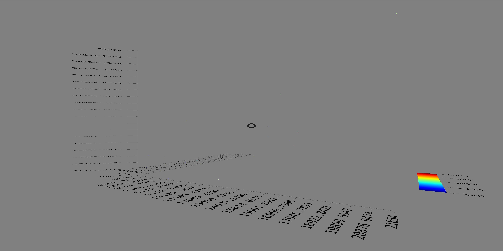

*[Back to the main page](../README.md)*


## Some 3D plots

Once I'm happy with webpack configuration,
let's go back to A-frame.
Focus. Focus! Focus!!

Did I say I need some focus?

I will work now on directory `plots-01`.
I'm going to play a bit with
[aframe-scatterplot](https://www.npmjs.com/package/aframe-scatterplot)

I start with a copy of my `templates` directory, and in it:

```
npm install
npm install aframe-scatterplot --save
npm install d3 --save
```

And add the dependencies to `src/main.js`:

```
...
import * as d3 from 'd3';
window.d3 = d3;
import 'aframe-scatterplot';
...
```

The assignment to `window.d3` is needed because `aframe-scatterplot`
seems to assume `d3` is defined as a global object.
If it is not defined that way, `aframe-scatterplot` just doesn't work.

Now, I get some data for defining a scatterplot:
[example dataset](https://raw.githubusercontent.com/zcanter/aframe-scatterplot/master/example/sample-data/cities.json):

```
$ wget https://raw.githubusercontent.com/zcanter/aframe-scatterplot/master/example/sample-data/cities.json
```

I place it under `src`.
I need to incorporate it to the webpack configuration,
so in `webpack.config.js` I add a new loader for JSON files
(I'm going to use `file-loader` for now,
maybe I will try specific JSON loaders later):

```
// JSON files
  {
    test: /\.json$/,
    include: [path.resolve(__dirname, 'src')],
    exclude: fontFilesPattern,
    loader: 'file-loader',
    options: {
    name: '[name].[ext]'
    }
  },
```

I also add the dependency in `main.js`:

```
...
const cities = require('./cities.json')
...
```

And that's it. Ready to add the magic to `index.html`,
so that I get a 3D scatterplot:

```
<a-scatterplot position="-0.5 1.2 -1.2" rotation="0 60 0"
  src="cities.json"
  x="Area" y="Pop 2000" z="Pop 1980" val="Vehicles">
</a-scatterplot>
```


