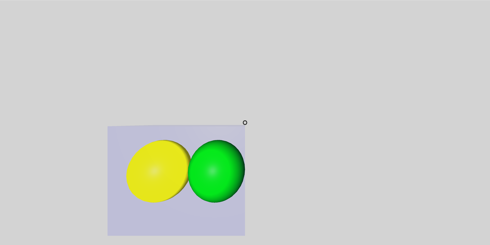
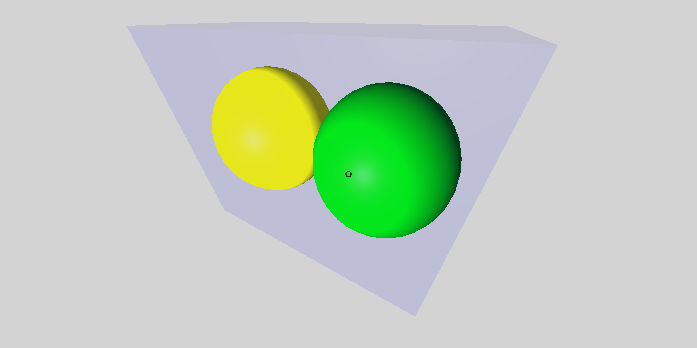
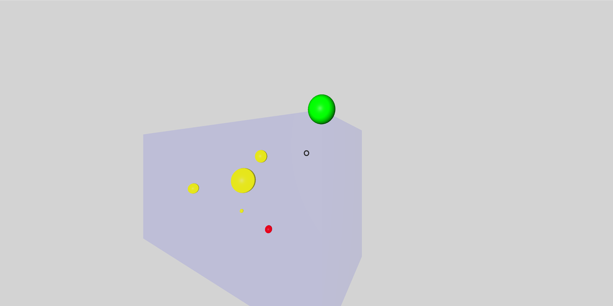

*[Back to the main page](../README.md)*

## Playing towards my 3D scatterplots

I got my first scatterplot. Let's go for more of them.
But now, I'm going to write my own code for that.
If you are impatient about the result,
click and [see it live](web/).

### Inserting spheres in the DOM

I start by learning to insert A-frame elements in the DOM.
Useful documentation:

* [Getting entities by querying and traversing](https://aframe.io/docs/1.4.0/introduction/javascript-events-dom-apis.html#getting-entities-by-querying-and-traversing).
Use of `.querySelector()` for locating elements in the DOM.

* [Adding a component with .setAttribute()](https://aframe.io/docs/1.4.0/core/entity.html#setattribute-attr-value-componentattrvalue). Use of `.setAttribute()` for setting attributes of an element.

The simplest code I write, which inserts to spheres in a scene,
is as follows:

```javascript
function sphere(parent, x, y, z, radius, color){
  var entity = document.createElement('a-sphere');
  entity.setAttribute('position',
    x.toString() + ' ' + y.toString() + ' ' + z.toString());
  entity.setAttribute('radius', radius.toString());
  entity.setAttribute('color', color);
  parent.appendChild(entity);
};

function main() {
  var sceneEl = document.querySelector('a-scene');
  sphere(sceneEl, -2, 1.25, -5, 1.25, 'yellow');
  sphere(sceneEl, 2, 1.25, -5, 1.25, 'green');
};

document.addEventListener('DOMContentLoaded', main);
```

The `sphere` function just produces an A-frame sphere entity
(using `createElement`),
sets its position, radius and color
(using `setAttribute` to set its attributes),
and inserts it into the DOM, as a child of `parent`.

The main code just gets the `a-scene` element
(which is defined in `index.html`, and should be unique),
and inserts two spheres in it.

### Using a framing box

Since I'm interested in producing a 3D scatterplot,
I'm going to have to frame it into a box,
which will define the dimensions of the plot.
So, I'm going to explore how to produce a box element,
and insert some spheres into it. The resulting code is as follows:

```javascript
// Produce a box, insert it in parent element, return it
function box(parent, x, y, z, lenght_x, lenght_y, lenght_z, color){
  var entity = document.createElement('a-box');
  entity.setAttribute('position', {x: x, y: y, z: z});
  entity.setAttribute('geometry', {
    'width': lenght_x,
    'height': lenght_y,
    'depth': lenght_z
  });
  entity.setAttribute('material', {
    'color': color,
    'transparent': true,
    'opacity': 0.1
  });
  parent.appendChild(entity);
  return(entity);
};

// Produce a sphere, insert it in parent element, return it
function sphere(parent, x, y, z, radius, color){
  var entity = document.createElement('a-sphere');
  entity.setAttribute('position', {x: x, y: y, z: z});
  entity.setAttribute('geometry', {'radius': radius});
  entity.setAttribute('material', {'color': color});
  parent.appendChild(entity);
  return(entity);
};

function main() {
  var sceneEl = document.querySelector('a-scene');
  var boxEl = box(sceneEl, -2, 0, -5, 4, 3, 2, 'blue')
  sphere(boxEl, -1, 0, 0, 1, 'yellow');
  sphere(boxEl, 1, 0, 0, 1, 'green');
};

document.addEventListener('DOMContentLoaded', main);
```

The code is similar to the first exploration above,
but now I have separate functions for producing the framing box (`box`)
and the spheres.
I'm also exploring other ways to set the attributes,
such as setting directly `position`, `geometry` and `material`
(instead of, for example,
joining all position coordinates into a string, as I did before).
Important notice: the coordinates of the spheres are now
relative to the box, since they are defined as their children.

See below two screenshots of the scene with the
framing box and the two spheres.





### Towards a scatterplot

Let's do something more interesting.
I'm going to use spheres to represent points in a 3D scatterplot.
For that, I write an A-frame component, `scatterplot`,
which will have the data for the plot
(an array of points, each with their coordinates, size, and color).
I will add this component to an `a-box` element,
which will act as a framing box for the scatterplot.
Coordinates of the points in the scatterplot will be their own,
and they will be converted to fit in the framing box.
The complete code is in `index.html` and `main.js` in the `plots-02`
directory.

The result is as follows:



Some of the documentation I've used:

* [Writing a Component](https://aframe.io/docs/1.4.0/introduction/writing-a-component.html)
* [How to Write an A-Frame VR Component](http://ngokevin.com/blog/aframe-component)

Now, the code. The main function is quite simple:

```javascript
function main() {
  create_components();
  var scene = document.querySelector('a-scene');
  var frame = document.createElement('a-box');
  frame.setAttribute('position', {x: -3, y: 0, z: -8});
  frame.setAttribute('geometry', {width: 10, height: 5, depth: 4});
  frame.setAttribute('rotation', {x: 0, y: -30, z: 0},);
  frame.setAttribute('material', {
    'color': 'blue',
    'transparent': true,
    'opacity': 0.1
  });
  scene.appendChild(frame);
  frame.setAttribute('scatterplot', 'points',
    '[{"x": -3, "y": 0, "z": -4, "radius": 0.2, "color": "red"},' +
     '{"x": -4, "y": 1, "z": -2, "radius": 0.1, "color": "yellow"},' +
     '{"x": -6.7, "y": 2, "z": 0, "radius": 0.3, "color": "yellow"},' +
     '{"x": -2.4, "y": 3, "z": 2, "radius": 0.5, "color": "yellow"},' +
     '{"x": -1, "y": 4, "z": 4, "radius": 0.2, "color": "yellow"},' +
     '{"x": 1, "y": 5, "z": 6, "radius": 0.3, "color": "green"}]');
};
```

The function `create_components` creates the `scatterplot` component,
and registers it with A-Frame.
Then, I get the element corresponding to `a-scene`
(which you can find in `index.html`),
create the `a-box` which will be used as frame for the scatterplot,
set its basic attributes,
and set `scatterplot` as one of its attributes.
`scatterplot` has, in its `points` proprierty,
the description of the scatterplot to plot:
a list of all the points,
each of them in the format {x, y, z, radius, color}.

So, the magic is done by the `scatterplot` component.
Its structure is as follows (code in `create_components`):

```javascript
AFRAME.registerComponent('scatterplot', {
  schema: {
    points: {
      parse: JSON.parse,
      stringify: JSON.stringify
    }
  },
  init: function () {
    ...
  },
  chart_bounds: function() {
    ...
  },
  to_frame_coords: function(chart_coords) {
    ...
  },
  point: function (position, radius, color){
    ...
  },
});
```

The `schema` defines the attribute that the component will have.
In my case, it is a single attrribute: `points`.
It is a string, in JSON format,
with the data for all the points in the scatterplot.
See the code in `main` for an example of a description of the plot.
You can get some more detail about a JSON string in the
schema for a component in this
[answer in StackOverflow](https://stackoverflow.com/a/41545576/2075265).
Both JSON.parse (which parses the string and converts it into an object)
and JSON.stringify (which converts an object into a JSON string)
are already available, so no need to import more modules.

The `init` function is standard for an A-frame component,
and will be called when the component is created.
It will insert into the framing box the spheres that will represent the
points in the plot,
locating them properly,
by computing their coordinates relative to the box.

The other functions are specific to implement what is needed in 'init':

* `chart_bounds` computes the bounds (maximum value, minimum value,
  and size for each coordinate) for the chart,
  in 'chart coordinates'.
* `to_frame_coords` converts chart coordinates
(those in which the points are specified)
to coordinates relative to the frame,
using properties computer by `chart_bounds`.
* `point` creates the sphere corresponding to a point,
and inserts it as a child of the framing box.

Code for `init` is below.
Computes some properties: `chart_bounds` and `chart_size`,
using the function `chart_bounds`, and `frame_size`.
All of them are conveniently stored as properties of `this.data`,
which is visible also as `this.el.components.scatterplot.data`.
Then, all the points are plotted as spheres,
using the `point` function.

```javascript
init: function () {
  var geometry = this.el.components.geometry.data;
  this.data.frame_size = {x: geometry.width,
    y: geometry.height,
    z: geometry.depth};
  var bounds = this.chart_bounds();
  this.data.chart_bounds = {max: bounds.max, min: bounds.min};
  this.data.chart_size = bounds.size
  for (const point of this.data.points) {
    var position = this.to_frame_coords({x: point.x, y: point.y, z: point.z});
    this.point(position, point.radius, point.color);
  };
},
```

Code for `chart_bounds`, below.
Just look for the minum and maximum value for each coordinate,
for all the points.
Computes the size (maximum minus minimum) of the chart too.

```javascript
chart_bounds: function() {
  var max = {x: 0, y: 0, z: 0};
  var min = {x: 0, y: 0, z: 0};
  for (const point of this.data.points) {
    for (const coord in point) {
      if (point[coord] > max[coord]) {
        max[coord] = point[coord];
      } else if (point[coord] < min[coord]) {
        min[coord] = point[coord];
      };
    };
  };
  var size = {};
  for (const coord in max) {
    size[coord] = max[coord] - min[coord];
  };
  return {max: max, min: min, size: size};
},
```

Code for `to_frame_coords`, below.
Scales from chart coordinates
(those used for the list of points)
to frame coordinates.
Frame coordinates are those used to specify the position
of spheres corresponding to points,
relative to the framing box.
uses the values produced by `chart_bounds`,
which were stored in `chart_bounds` and `chart_size`
proprerties of the component.

```javascript
to_frame_coords: function(chart_coords) {
  var frame_coords = {};
  var chart_min = this.data.chart_bounds.min;
  var chart_size = this.data.chart_size;
  var frame_size = this.data.frame_size;
  for (const coord in chart_coords) {
    frame_coords[coord] =
      (((chart_coords[coord] - chart_min[coord]) *
        frame_size[coord]) /
      chart_size[coord]) - frame_size[coord] / 2;
  }
  return frame_coords;
},
```

Code for `point` is below.
Inserts a sphere, corresponding to a point in the plot,
in the appropriate position,
relative to the framing box.
Position is in framing box coordinates.

```javascript
point: function (position, radius, color){
  var sphere = document.createElement('a-sphere');
  sphere.setAttribute('position', position);
  sphere.setAttribute('geometry', {'radius': radius});
  sphere.setAttribute('material', {'color': color});
  this.el.appendChild(sphere);
  return(sphere);
},
```
